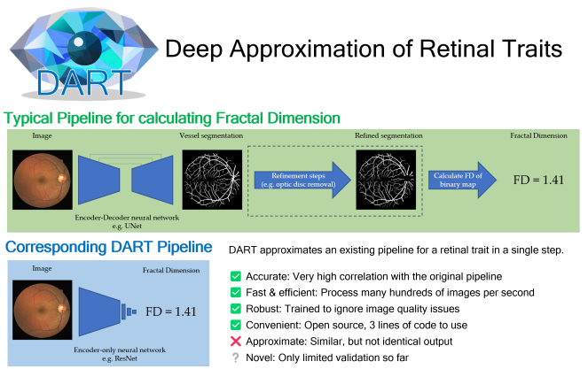

[](https://colab.research.google.com/github/justinengelmann/DART_retinal_fractal_dimension/blob/main/ColabNotebook/ColabVersion_DART_tutorial_and_demo.ipynb) 

Code for "Robust and efficient computation of retinal fractal dimension through deep approximation" (preprint: https://arxiv.org/abs/2207.05757
; to appear in the Proceedings of the 9th MICCAI Workshop on Ophthalmic Medical Image Analysis)

DART (Deep Approximation of Retinal Traits) allows to compute retinal traits very quickly (200-1,000 img/s on a single machine) and in a way that is more robust to image quality
issues. We achieve that by approximating an existing pipeline for calculating a retinal trait with a deep neural
network. This network outputs the target value directly, without any intermediate steps, and can be trained to ignore
quality variations.

Currently, we support retinal Fractal Dimension FD as calculated by VAMPIRE (an awesome tool,
see: https://vampire.computing.dundee.ac.uk/index.html) with the multi-fractal method. FD is a measure of how
complex/branching the retinal vasculature is. DART shows very high agreement (Pearson correlation of 0.9572) with VAMPIRE FD on held-out test images from UK Biobank.

### Quick start

#### Tutorial/Demo

The [tutorial notebook](DART_tutorial_and_demo.ipynb) demonstrates how to use DART and also showcases its speed and
robustness to image quality issues. For more in-depth results see our [preprint](https://arxiv.org/abs/2207.05757).

#### Inference pipeline (most convenient way to use DART)

```python
# simply create an inference pipeline
from dart import get_inference_pipeline
inference_pipeline = get_inference_pipeline(model_name='resnet18')
# your retinal fundus color image, PIL image or numpy array
# ideally square, no large black borders, and similar in appearance to UK Biobank / DRIVE
your_image = ...
FD_of_your_image = inference_pipeline(your_image)[0]
print('Fractal dimension of your image is:', FD_of_your_image)
```
That's it. Should be quite fast, even on a CPU. GPU will be faster, and batched inference (see below) will be even faster.

#### Installation / Setup
```commandline
(install pytorch and torchvision: https://pytorch.org/get-started/locally/)
git clone https://github.com/justinengelmann/DART_retinal_fractal_dimension.git
cd DART_retinal_fractal_dimension
pip install timm==0.5.4
```

Written in Python 3.9.12, but other versions are likely to work, too. I aimed to keep dependencies fairly low. You should only need to a more or less recent version of PyTorch / torchvision (I used versions 1.11.0 / 0.12.0 but backwards compatibility tends be quite good).
and timm (pytorch image models) version 0.5.4.

Optionally, you can also install albumentations version 1.2.0. The model was trained with albumentations for data augmentation, but
the torchvision equivalents of the preprocessing functions yield the same results up to tiny differences in the order of
1e-7 for the input images, and no difference in the output (in my limited testing).

If you run into any issues, please feel free to email me / open an issue. If you have a specific use case, it should be
possible to make a pytorch-free version of DART. (E.g. numpy-only inference pipeline)

### Other ways to use DART

```python
# 1. batched inference with the inference pipeline (faster than single images)
from dart import get_inference_pipeline
inference_pipeline = get_inference_pipeline(model_name='resnet18')
# iterate over your torch style dataloader
for batch_of_images in your_torch_data_loader:
    batch_of_images.cuda()  # if using GPU
    FD_of_batch = inference_pipeline(batch_of_images)[0]  # returns np array on cpu

# 2. access the components of the inference pipeline themselves
from dart import get_model_and_processing
# this returns a dict containing the model, preprocessing and postprocessing pipelines, and config
model_and_processing = get_model_and_processing(model_name='resnet18')
your_image = ...
your_image_preprocessed = model_and_processing['preprocessing'](your_image)
FD_unscaled = model_and_processing['model'](your_image_preprocessed)
FD_of_your_image = model_and_processing['postprocessing'](FD_unscaled)

# 3. access just the model
from dart import load_model
# pytorch compatible model, e.g. for writing your own highly efficient inference loop 
# (with your own preprocessing and postprocessing, see the cfg for details)
model = load_model(model_name='resnet18')
```

If you use our work, please cite our preprint:

```
@article{engelmann2022robust,
  title={Robust and efficient computation of retinal fractal dimension through deep approximation},
  author={Engelmann, Justin and Villaplana-Velasco, Ana and Storkey, Amos and Bernabeu, Miguel O},
  journal={arXiv preprint arXiv:2207.05757},
  year={2022}
}
```

as well as any and all relevant publications by the VAMPIRE authors, for example:

```
@inproceedings{trucco2013novel,
  title={Novel VAMPIRE algorithms for quantitative analysis of the retinal vasculature},
  author={Trucco, E and Ballerini, L and Relan, D and Giachetti, A and MacGillivray, T and Zutis, K and Lupascu, C and Tegolo, D and Pellegrini, E and Robertson, G and others},
  booktitle={2013 ISSNIP Biosignals and Biorobotics Conference: Biosignals and Robotics for Better and Safer Living (BRC)},
  pages={1--4},
  year={2013},
  organization={IEEE}
}
```